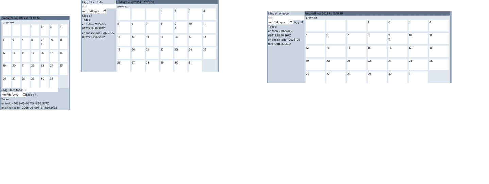
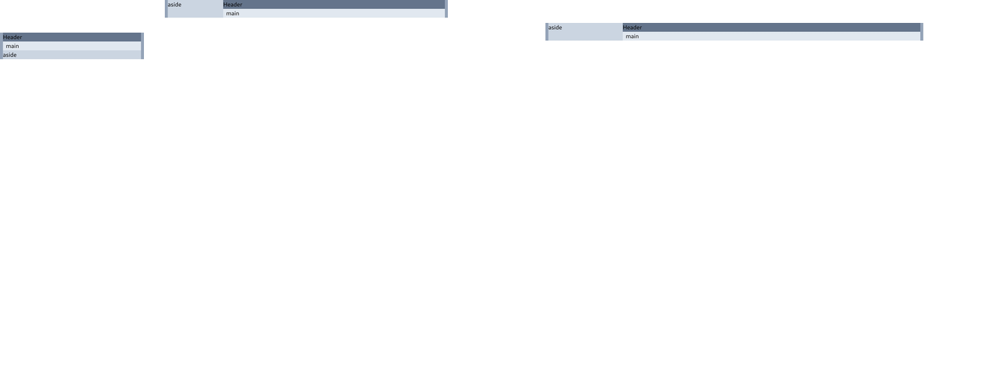

# Calendar todo app in React

A simple responsive calendar-based todo list built using React and Tailwind CSS. This project was my first hands-on exploration of React, focusing on writing components without using a full bundler setup.

https://gherghett.github.io/Calendar-Todo-App-in-React/



## The setup

I started taking a look at bundlers, Vite, Next.js and so on, but I really just wanted to dive into React as simply as possible.
```
├── app.jsx
├── index.html
```
Initially, I tried using a basic HTML file and a JSX file, loading React and ReactDOM via CDN in the HTML. My goal was to structure the app with components in separate files. However, browsers don’t handle non-standard extensions like .jsx well, and the CDN setup for JSX didn't work as expected. Maybe I did need a bundler after all?

I ended up putting all my JSX code into a single file, and spreading out the js. This way, I could avoid a complex setup and just get started coding in React.

## Sketching the Layout

I added a tailwind CDN and made a `template.html` to try getting my divisions into position and responsive before putting into react.

```html
<div id="container" class="bg-slate-400 flex flex-col sm:flex-row lg:w-[1024px] lg:mx-auto">
    <div class="w-full">
        <header class="bg-slate-500 w-full">Header</header>
        <main class="bg-slate-200 w-full">main</main>
    </div>
    <aside class="bg-slate-300 w-full sm:w-1/4 sm:-order-1">aside</aside>
</div>
```

```
├── app.jsx
├── index.html
├── tailwind.config.js <--added
├── template.html      <--added 
```

## Reusing Logic from another project

I had just done another project for school making a calendar, completely in vanilla js. I decided to reuse most of the logic, copying the js files, and importing what i needed. The goal wht this project was to see how manipulating the DOM differs when using React.

```
├── app.jsx
├── index.html
├── tailwind.config.js
├── template.html
├── calendar.js        <--added
└── todos.js           <--added
```

## Using React ⚛

I started with defining my root component, and thereafer the Calendar, which was the biggest  component, which was the largest both visually and in terms of complexity.

First i thought about how i would like to *use* the component
```jsx
<Calendar date={date} todos={todos} />
```
then the implementation
```jsx
function Calendar({ date, todos }) {

  // Making use of the imported logic, keeping components small
  const firstDay = firstDayOfMonth(date);
  const daysInThisMonth = daysInMonth(date.getFullYear(), date.getMonth());
  const emptyDays = daysInWeekBeforeFirstMonthDay(firstDay.getDay());

  /// ...
  
  const calendarDays = [];
  
  for (let i = 0; i < daysInThisMonth; i++) {
    const todosForDay = todos.filter((t) => t.day == i + 1).length;
    calendarDays.push(
        // the key thing tripped me up a couple of times
      <CalendarCell key={i} dateNumber={i + 1} todoCount={todosForDay} />
    );
  }
  
  return (
    <div id="calendar" className="grid grid-cols-7">  //styling with tailwind
      {/* Another components makes x empty days. Pretty involved solution in retrospect. */}
      <EmptyDays emptyDays={emptyDays} /> 
      {calendarDays}
    </div>
  );
}
```
## Styling

This would be a todo in this todo project. I'll use tailwind if I do it. For now, the main goal was understanding the basics of React, and I feel I achieved that. Next time trying React it will be with a bundler like Vite or Next and definitely with typescript because I miss type hinting.

## Writing the README

The screenshots were made using my python script [lineup-screenshots](https://github.com/gherghett/lineup-screenshots)
